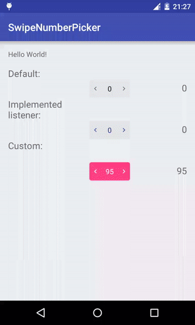

# SwipeNumberPicker

The library provides simple number picker. The number is selected with the swipe gesture, to right - increase, to left - decrease value. Also, by click NumberPickerDialog will be shown.

  

# Usage

Just add the dependency to your `build.gradle`:

```groovy
dependencies {
    compile 'com.github.supervital:swipenumberpicker:1.0.0'
}
```
In layout:

```xml
<com.vi.swipenumberpicker.SwipeNumberPicker
	android:id="@+id/number_picker"
	android:layout_width="wrap_content"
	android:layout_height="wrap_content"
	android:layout_alignParentBottom="true"
	android:layout_alignParentLeft="true"
	app:numberColor="@android:color/white"
	app:arrowColor="@android:color/white"
	app:backgroundColor="@color/colorAccent"
	app:max="1000"
	app:min="50"
	app:value="95"/>
```

Attributes:

``` xml
	<attr name="min" format="integer"/>
	<attr name="max" format="integer"/>
	<attr name="value" format="integer"/>
	<attr name="arrowColor" format="color"/>
	<attr name="backgroundColor" format="color"/>
	<attr name="numberColor" format="color"/>
```

To set changed value implement the `OnValueChangeListener` listener and on `onValueChange` return `true`

```Java
	swipeNumberPicker.setOnValueChangeListener(new OnValueChangeListener() {
		@Override
		public boolean onValueChange(SwipeNumberPicker view, int oldValue, int newValue) {
			boolean isValueOk = (newValue & 1) == 0;
			if (isValueOk)
				result1.setText(Integer.toString(newValue));
	
			return isValueOk;
		}
	});
```

Also you can:
* disable/enable SwipeNumberPicker;
* disable/enable Showing of a NumberPicker Dialog. If the dialog disabled `View.OnClickListener` will be called;
* set the dialog title;
* set min, max values;
* set value.


License
=======

    Copyright (C) 2015 Vitalii Ishchuk

    Licensed under the Apache License, Version 2.0 (the "License");
    you may not use this file except in compliance with the License.
    You may obtain a copy of the License at

         http://www.apache.org/licenses/LICENSE-2.0

    Unless required by applicable law or agreed to in writing, software
    distributed under the License is distributed on an "AS IS" BASIS,
    WITHOUT WARRANTIES OR CONDITIONS OF ANY KIND, either express or implied.
    See the License for the specific language governing permissions and
    limitations under the License.
